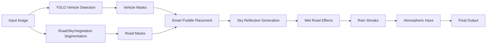

# Rain Simulation for Mining Site Data Augmentation

Advanced rain simulation system using AI-powered vehicle detection and realistic puddle generation for mining site images. Creates authentic rainy conditions with smart road/vehicle segregation.

## ✨ Key Features

### 🚛 Smart Vehicle Detection
- **YOLOv11 Integration**: Site-specific model detects 6 vehicle types (tipper, car, bus, dozer, grader, truck)
- **Intelligent Exclusion**: Potholes never appear on vehicles, only on road areas
- **Automatic Fallback**: Uses DeepLabV3 if YOLO model unavailable

### 💧 Realistic Puddle Generation
- **Organic Shapes**: Random polygon generation (6-12 vertices) creates irregular, natural puddle shapes
- **Rounded Edges**: Multiple smoothing layers ensure realistic, soft boundaries
- **Sky Reflections**: Puddles reflect the sky above, not the ground (physically accurate)
- **Adaptive Count**: 4-5 puddles based on road area size
- **Moderate Size**: 4-8% of image dimensions per puddle

### 🌧️ Atmospheric Rain Effects
- **Multi-layer Rain Streaks**: 3 depth layers (background/midground/foreground)
- **Depth-based Fog**: Atmospheric haze increases with distance
- **Wet Road Surface**: Subtle darkening with specular highlights
- **Cool Color Shift**: Contrast reduction and desaturation for rainy atmosphere

### 🎯 Semantic Segmentation
- **Road Detection**: Manual mask support or automatic mining road detection
- **Region-Aware**: Different effects for road, vegetation, sky, and vehicles
- **Vehicle-Aware Boundaries**: Smooth transitions around detected vehicles

## 📦 Installation

```bash
# Install dependencies
pip install -r requirements.txt

# If using separate ultralytics environment
source ~/ultralytics-env/bin/activate
```

### Requirements
```
opencv-python>=4.8.0
numpy>=1.24.0
torch>=2.0.0
torchvision>=0.15.0
ultralytics>=8.0.0
```

## 🚀 Quick Start

### 1. Setup Model (Required)
Place your YOLOv11 vehicle detection model in the project directory:
```
rain_simulation/
├── site_2_yolov11n_v1+v2.pt  ← Your YOLO model here
├── realistic_rain_gen.py
├── input_files/
└── output_files/
```

### 2. Add Input Images
Place images in the `input_files/` directory:
```bash
rain_simulation/input_files/
├── image1.jpg
├── image2.jpg
└── ...
```

### 3. Run Simulation
```bash
python realistic_rain_gen.py
```

### 4. Get Results
Augmented images will be saved in `output_files/` with `rain_` prefix.

## 📖 Usage

### Basic Usage
```python
from realistic_rain_gen import apply_rain
import cv2

# Load image
img = cv2.imread("your_image.jpg")

# Apply rain simulation
result = apply_rain(img)

# Save result
cv2.imwrite("rainy_output.jpg", result)
```

### Optional: Manual Road Mask
For consistent road detection, provide a manual road mask:

1. Create `road_mask.png` in the project directory
2. Paint road areas WHITE (255)
3. Paint non-road areas BLACK (0)
4. Script will automatically use it instead of auto-detection

## 🔄 Processing Pipeline



### Step-by-Step Process:
1. **Vehicle Detection** - YOLO identifies all vehicles (bounding boxes → masks)
2. **Region Segmentation** - DeepLabV3 segments road, sky, vegetation
3. **Puddle Generation** - 4-5 organic random shapes on safe road areas (excluding vehicles)
4. **Sky Reflection** - Extract top 50% of image, apply as puddle reflection
5. **Wet Effects** - Moderate road darkening (0.85) with specular highlights
6. **Rain Streaks** - Multi-layer streak overlay with depth variation
7. **Atmospheric Effects** - Depth fog, desaturation, cool color shift

## 🎛️ Customization

### Adjust Puddle Count
Edit in `realistic_rain_gen.py` (around line 387):
```python
# Adaptive puddle count
if road_ratio > 0.4:
    num_puddles = 5  # Change this
elif road_ratio > 0.2:
    num_puddles = 4  # Or this
```

### Adjust Puddle Size
Edit puddle radius range (line ~434):
```python
# Moderate puddle size (4-8% average radius)
avg_radius = int(min(rows, cols) * np.random.uniform(0.04, 0.08))  # Adjust range
```

### Adjust Road Darkening
Edit darkening factor (line ~328):
```python
darkening = 0.85  # Higher = lighter road (0.0-1.0)
```

### Rain Density
Edit rain streak density (line ~550):
```python
rain = RainEffects.generate_rain_streaks(img.shape, density=0.006)  # Increase for more rain
```

## 🏗️ Project Structure

```
rain_simulation/
├── realistic_rain_gen.py          # Main script
├── site_2_yolov11n_v1+v2.pt       # YOLO model (user-provided)
├── road_mask.png                  # Optional manual road mask
├── requirements.txt               # Dependencies
├── README.md                      # This file
├── input_files/                   # Input images directory
│   └── *.jpg
└── output_files/                  # Output images directory
    └── rain_*.jpg
```

## 🧪 Technical Details

### Puddle Shape Generation Algorithm
Uses random polygon generation with high irregularity:
- **Vertices**: 6-12 random points
- **Angular variation**: ±0.8 radians for irregularity
- **Radius variation**: 50-150% for spikiness
- **Multi-layer smoothing**: 31x31 + 25x25 Gaussian blur for rounded edges
- **Noise erosion**: Random edge variation for organic appearance

### Sky Reflection Method
- Extract top 50% of image (sky region)
- Resize to full image dimensions
- Apply water distortion blur (7x7)
- Darken by 50% (water absorption)
- Add blue-green tint (realistic water color)
- Blend 50/50 with darkened puddle base

### Vehicle Detection
- YOLO inference generates bounding boxes
- Convert to binary masks
- Dilate by 15px to capture full vehicle extent
- Exclude from puddle placement area
- Smooth transitions at boundaries

## 🎨 Output Examples

**Generated Effects:**
- ✅ 4-5 irregular puddles per image
- ✅ Organic blob shapes with rounded edges
- ✅ Sky reflections visible in water
- ✅ No puddles on vehicles
- ✅ Authentic wet road appearance
- ✅ Multi-layer rain streaks
- ✅ Atmospheric depth haze

## ⚙️ System Requirements

- **GPU**: CUDA-compatible GPU recommended (uses torch with CUDA)
- **RAM**: 4GB minimum, 8GB+ recommended
- **Python**: 3.8+
- **OS**: Linux, Windows, macOS

## 🐛 Troubleshooting

### YOLO Model Not Found
```
Warning: YOLO model not found at /path/to/site_2_yolov11n_v1+v2.pt
Falling back to DeepLabV3 vehicle detection.
```
**Solution**: Ensure `site_2_yolov11n_v1+v2.pt` is in the project directory.

### Ultralytics Not Found
```
Warning: ultralytics not found. Install with: pip install ultralytics
```
**Solution**: 
```bash
pip install ultralytics
# Or activate environment where it's installed
source ~/ultralytics-env/bin/activate
```

### No Puddles Generated
**Possible causes**:
- Road mask too restrictive
- Vehicles covering entire road
- Image size very small

**Solution**: Check `road_mask.png` or let auto-detection run.

## 📄 License

This project is for data augmentation in mining site computer vision applications.

## 🙏 Acknowledgments

- **Ultralytics YOLOv11**: Real-time object detection
- **PyTorch**: Deep learning framework
- **DeepLabV3**: Semantic segmentation
- **OpenCV**: Computer vision operations

---

**Note**: This script is optimized for mining site images with unpaved roads and heavy vehicles. For different environments, adjust road detection parameters and vehicle classes accordingly.
